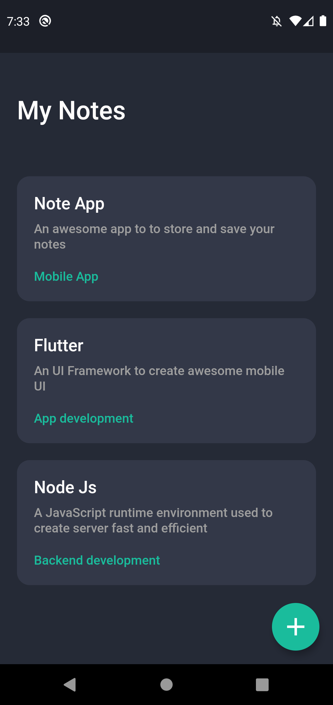
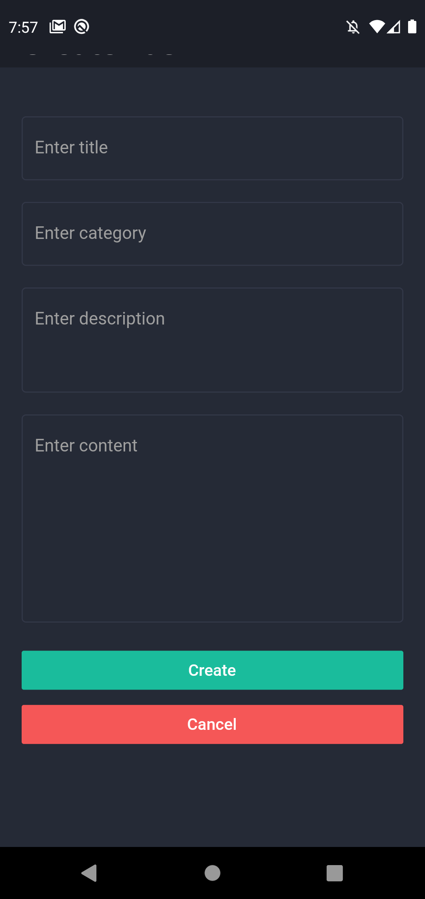
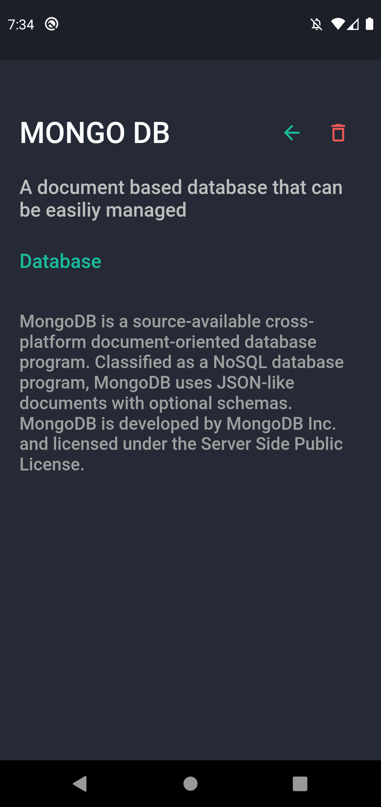

# NOTE APP 📚

Taking your note 😉 An app where you can store notes 📝

## screenshots 📷

 |  | 

## made using 🧱

- Flutter 📱
- Node js 💻
- Mongo db 💾

#### 

### Setup 👷‍♂️

1. download this project

   > I assume you have flutter, node, npm, mongo db
   >
   > if note make sure to do so

2. setup server
   - cd `server/`
   - `npm install`
   - `node server.js`

3. setup app

   - cd `/app`

   - `flutter pub get`

   - `flutter run`

     > In `app/lib/model/network.dart`
     >
     > I gave port 5000 on your system where usually your server runs
     >
     > if you changed port or server please ensure to change it too 😉