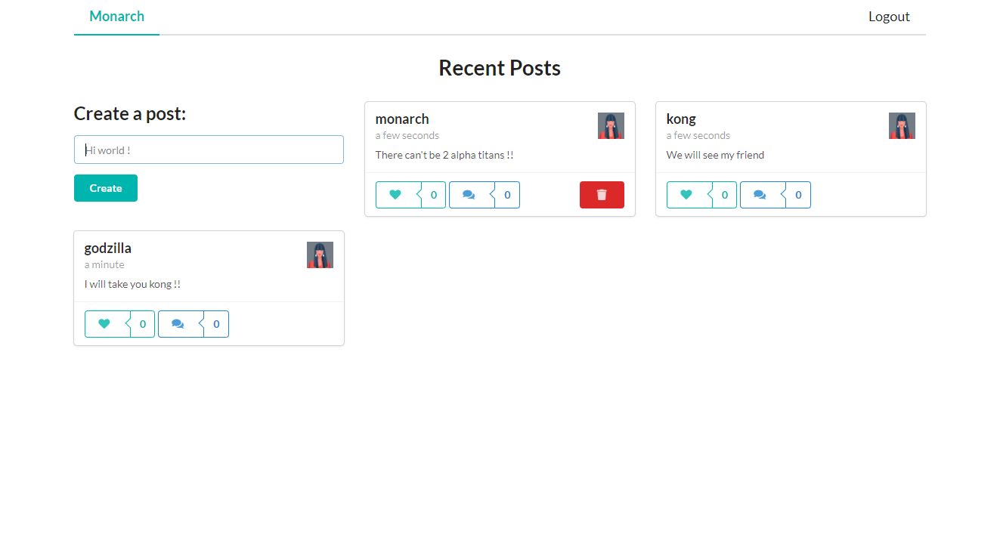
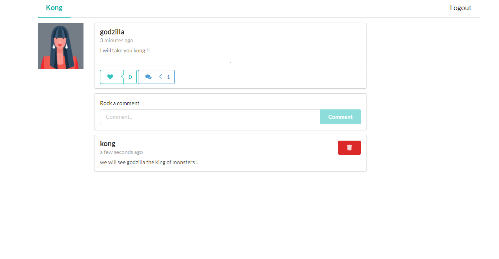

# SOCIAL MEDIA 📱

And web app made using __Mongo Db, Express, React, Node, Graphql__ [merng] 😉


Tutorial from https://youtu.be/n1mdAPFq2Os

<br />

 | 

<br />

## Features

- User can login or register 
- Logged in user can create posts
- Other users can like or comment in posts

<br>

## Setup

<br />

> I assume you have node js, npm, mongo db installed
>
> if not make it

<br />

1. created a `.env` file in root of directories

   make it as `.env-template`

   ```javascript
   database="you mongodb url"
   jwtKey="super-secret-password-for-jwt"
   ```

   

2. install dependecies
   - `npm install` from root of directory
   - navigate to client folder and  run `npm install` 

3. run
   - `node index.js` from root
   - `npm start` from client folder

